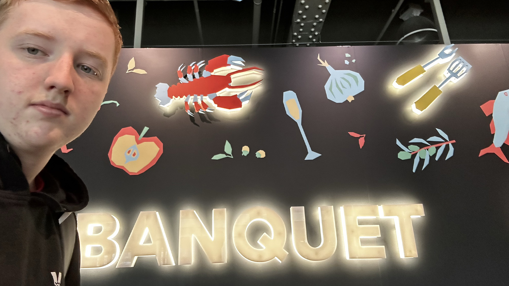
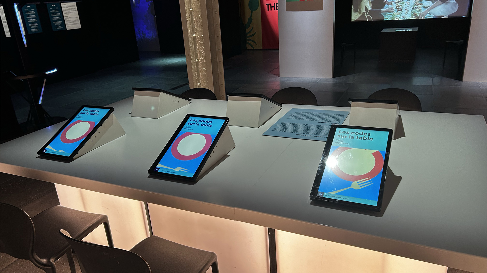
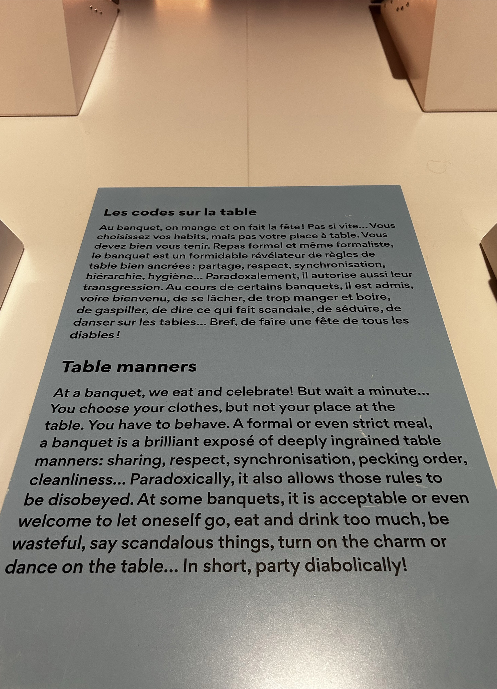
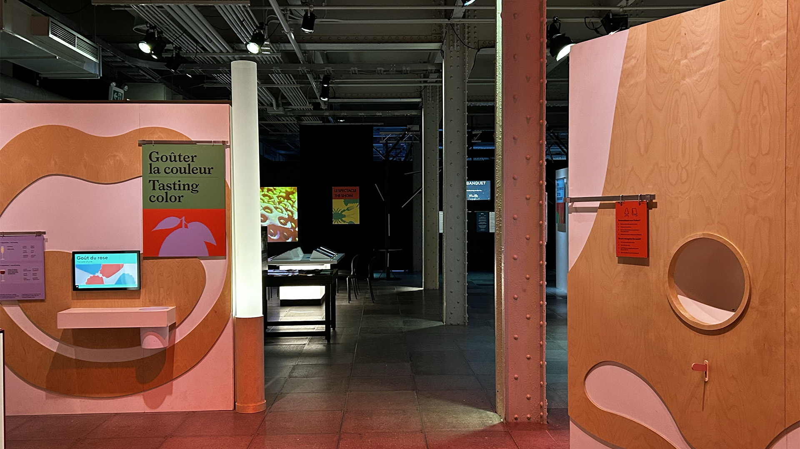
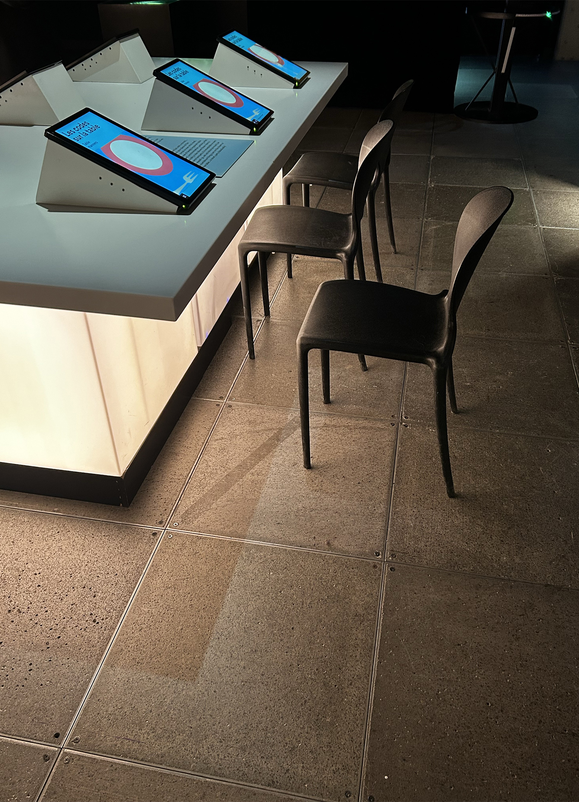
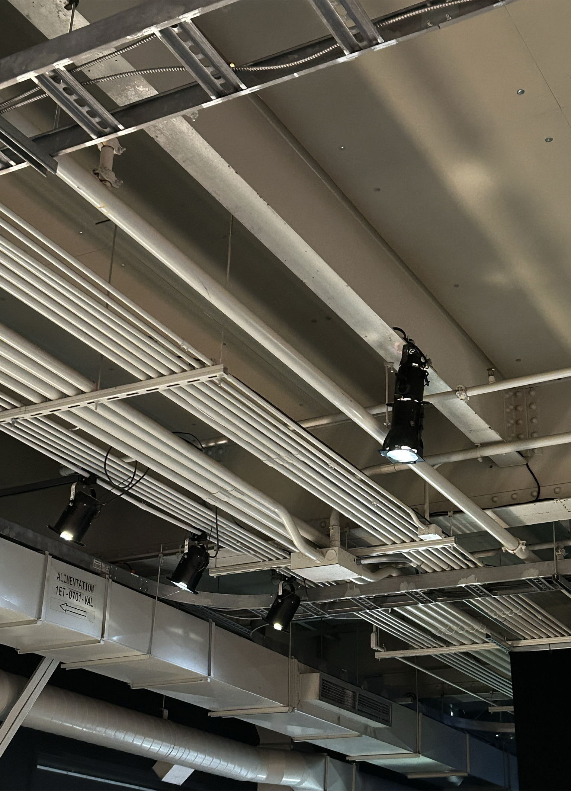

# Le banquet

  

## Centre des sciences

Cette exposition est temporaire.
J'ai pu visité cette exposition le 2025/01/31

## Les codes sur la table

Cette installation a été crée par la cité des sciences et industrie.
Cette installation a été crée lors de la sortie de l'exposition le banquet le 2024/05/16.
Cette exposition est une table avec des écrans intéractives avec laquelle on répond à des questions. 
Lorsque nous répondont a ces questions celles-ci sont comparés avec les anciens participants pour nous montrer les facons d'agir de la communauté.

### Mise en espace du dispositif

### Les composantes du dispositif

 

#### Élément nécessaire a la mise en exposition

Les composantes du dispositif sont une table, des écrans, des lumière, des câble et des lumières.

### Comment utiliser le dispositif

<video scr="../centre_des_sciences/medias/MicrosoftTeams-video.mp4">

### Ce qui ma plu

Ce qui ma plus de ce dispositif est l'intéractivité avec l'utilisateur est la  reunification entre tout les utilisateurs. Grace aux réponses que l'on donne au dispositif, nous pouvons nous comparer aux autres pour savoir si nous avons des bonnes habitude de vie.

