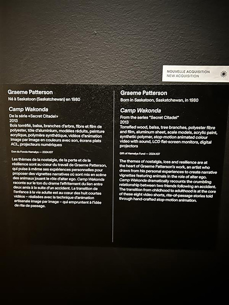
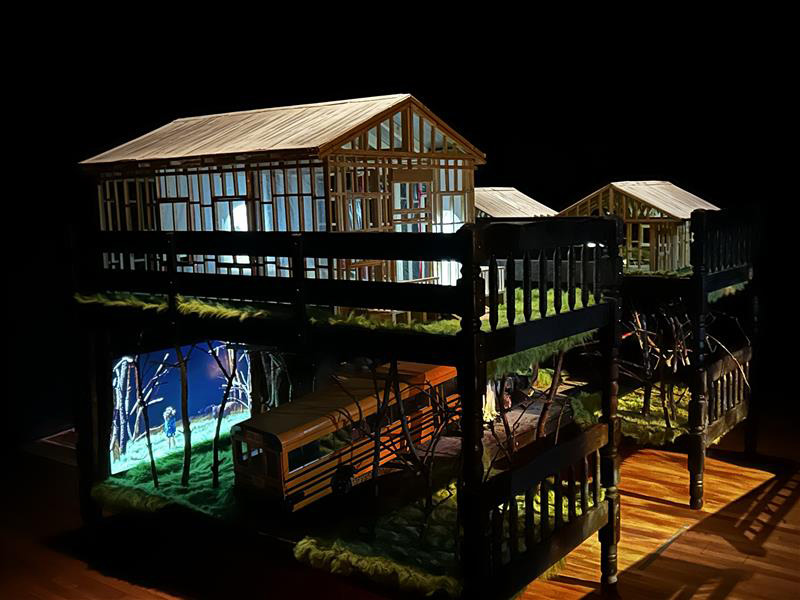
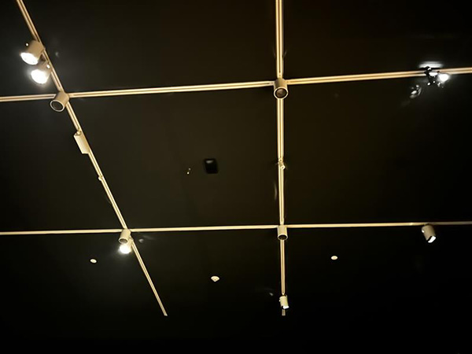
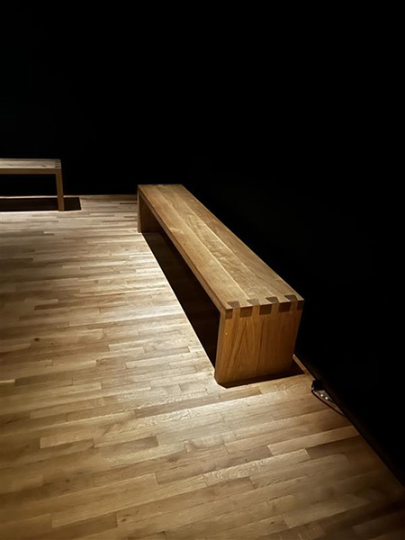
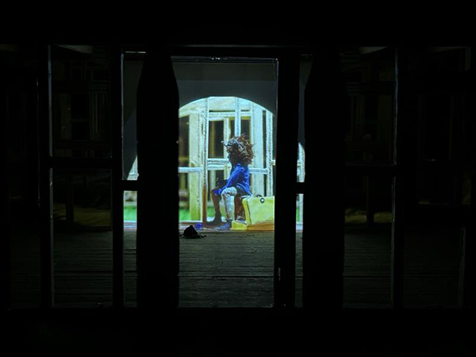
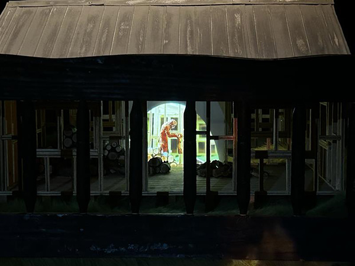
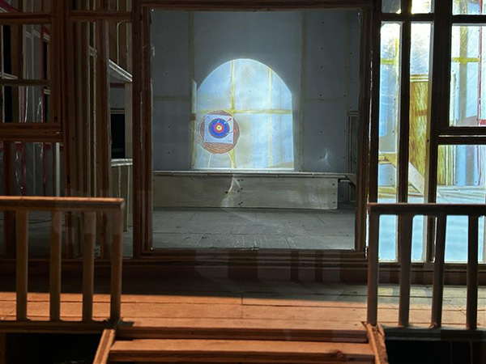
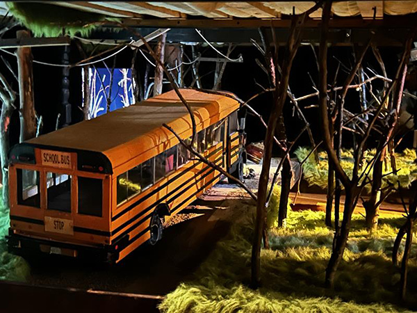
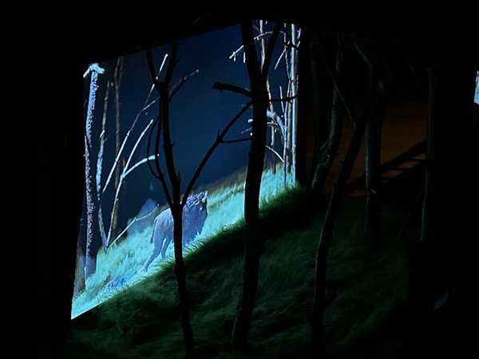
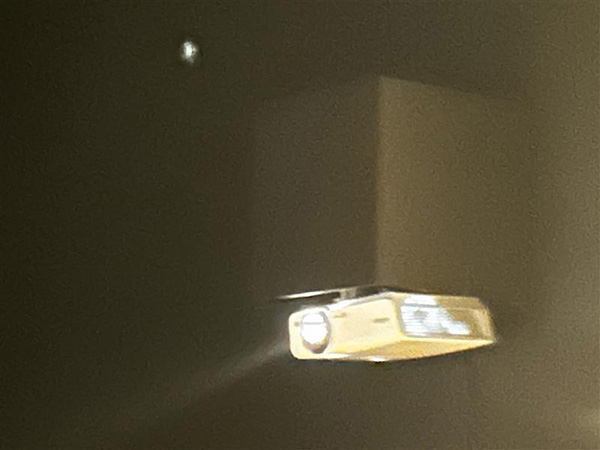

# Lieu de mise en exposition

Musée des beaux arts Montréal

## Information

J'ai pu aller visiter le musée des beaux arts de Montréal le 4 avril 2025. J'ai pu regarder le dispositif camp wakonda crée par Graeme Wakonda en 2013. Le dispositif est situé a l'intérieur du bâtiment. 

### Description de l'oeuvre

### Mise en espace

Le dispositif est seul au millieu d'une pièce avec un toit très haut. Il y a des bancs pour qu'on puisse s'assoir, sa nous sert a pouvoir contempler le dispositif.

#### Composantes et techniques

Lorsque nous rentrons dans la pièce, il y a une maison en haut a gauche, une autre en haut a droite, une derière celle de droite et un bus au millieu du dispositif.

#### Éléments nécessaires à la mise en exposition

Les éléments nécessaires a la mise en exposition son: des cables, des projecteur, du bois, un bus miniature, une salle pour exposer le dispositif, du carton, des tissus, des haut-parleurs et des banc.

#### Expérience vécue

Lorsque je suis rentré dans la salle, notre regard est attiré vers l'oeuvre car la pièce est sombre mais pas le dispositif. Mon regard était captivé sur le dispositif.

#### Ce qui m'a plu

Le dispositif était très beau et l'utlisaion des matériaux rendait celui-ci unique.
