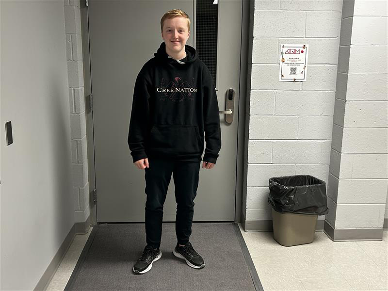

# Expositon des finissants en technique multimédia (TIM)

## resonance

### Une photo de moi devant l'exposition

### Date de ma visite

18 mars 2025

## Projets créés par les finissants

### CONDU8

CONDU8 est un jeu de course dont tu es le joueur en étant sur un vélo.

### Etheria

Un jeu vidéo dont le but est de défendre sa tour contre les ennemis.

### Arcadia

Jeu video 2d on doit se battre contre des ennemis et avancer dans l'histoire en collectant des morceaux de carte.

### Fuga

Fuga est un jeu intéractif qui crée un arbre avec de la modélisation.

### Internature

Un grand tunnel avec des projections d'image dessus projeter a l'aide d'une boule et des sons son produit grâce a boule.

### Prismatica

Prismatica est une projection d'un dessin que l'on dessine sur une planche.

### Luminatura

Luminatura est une projection sur un mur d'onde coloré.

# Description des projets

## CONDU8
### Équipe
Leur équipe est composé de :Ian Corbin, Sanuel Desmeules Voyer, Alexandre Gervais, Kevin Malric et Jérémy Roy Coté.

### Description

### Installation

## Etheria
### Équipe
Les personnes ayant réaliser ce projet sont: Joshua , Victor Gileau, Michael Un Dupré, Pierre et Maïk Hamel

### Description

### Installation

## Arcadia
### Équipe
Les créateur de se jeu vidéo sont: Dominic Yale, William Beauvais et Anton Nikulin.

### Description

### Installation

## Fuga
### Équipe
Les concepteurs de ce dispositif de modélisation sont: Matis, Tristan, Daniel, Abdel et Yavuz.

### Description

### Installation

## Internature
### Équipe
Les personnes ayant réaliser ce géant tunnel sont: Khaly Tia Sing, Isaac Fafard, Delphine Grenier, Sitmonternna Yi et Kenza El Harrif.

### Description

### Installation

## Prismatica
### Équipe
Les créateurs de se dispositif sont: Vincent Delisle, Ikrame Rata et Jérémy Duverseau.

### Description

### Installation

## Luminatura
### Équipe
Les réalisateurs de cette projection murale sont: Audrey, Justine, Camilia, Prethiah et Ihab.

### Description

### Installation

