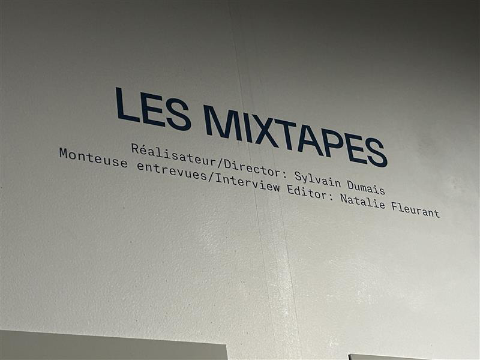
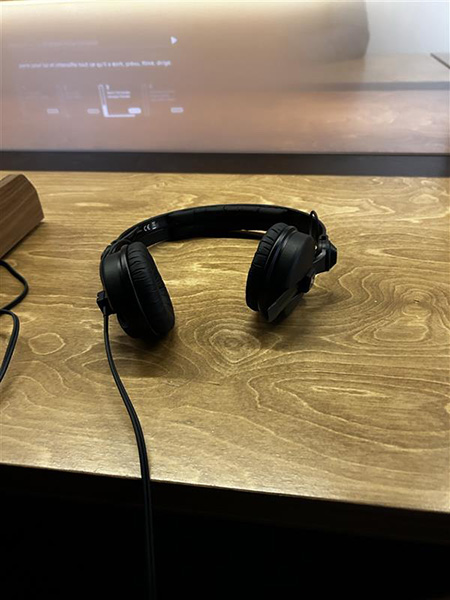
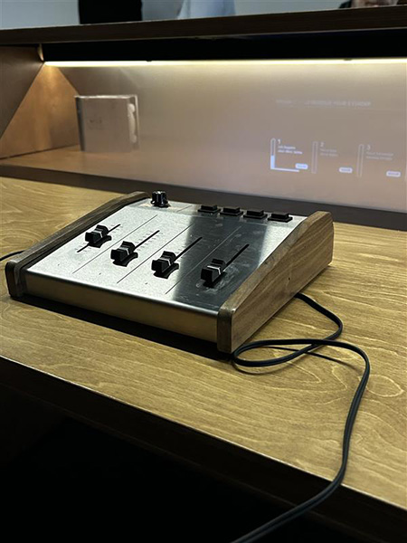
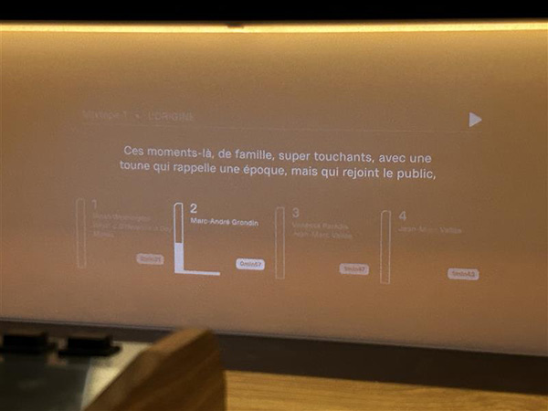

# Exposition Individuel de Jean Marc Vallé | Mixtape

### Date de visite

Visite le 21 février.

## Exposition

Une madame nous explique qui était Jean Marc Vallé. Elle a aussi parler des 3 dispositifs pour pouvoir mieux les comprendres. Puis elle nous laisse allé exploré la première exposition Prélude. Par la suite nous avons pu regardé un petit court métrage sur la jeunesse de Jean Marc Vallé. 

#### Mixtape

Après le court métrage il y avait l'exposition principale Mixtape. Une madame nous explique qui était Jean Marc Vallé. Elle a aussi parler des 3 dispositifs pour pouvoir mieux les comprendres. L'expositon est auditif et temporaire. Un grand mur présentait toute les aventures de Jean Marc Vallé. 

### Description du dispositif

Une mixtape c'est une piste audio qui nous explique se qui influencait Jean Marc Vallé lors de ses créations. 

### Installation

  

Les éléments utilisés par le dispositif son: un casque, un projecteur, un mixeur audio, des chaise, un ordi.

### Ressentie personelle

Je n'ai pas aimer le dispositif car se n'est pas mon genre de dispositif que j'aime, car je ne suis pas une personne qui écoute beaucoup. L'exposition est adapté au personne qui aime écouter.
