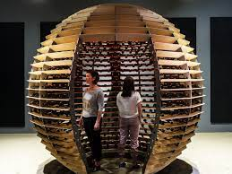
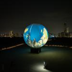

# Studio Lozano Hemmer

Lors de la conférence on a apprit l'arrière du décor d'une entreprise ou d'un groupe dans la réalisation d'art. Il y a eu lors de la conférence la description de tout les métiers qu'il doit être nécessaire pour toute leur réalisation. Le role le plus nécessaire dans le millieu des arts est celui de Jade Seguela (la présentatrice de la conférence).

Sans elle ou une personne comme elle, les expositions dans des musées ne serait pas possible. Son travail consiste a compté toute les pièces de l'oeuvre, les classés, séparé les compartiments de l'oeuvre pour des expéditions. Par exemple, elle a parlé lors de sa conférence d'une exposition appelé Antimodular. Le dispositif qu'elle nous a présenter <i>Sphere Packing: Bach</i> est une boule muni de plusieurs haut-parleurs qui joue les 2000 pièces musicals d'un artiste. Elle a du annoter sur tout les câbles un numéro pour pouvoir identifier quelle câble allait où. Elle a du séparé le dispositif en 10 boites, 9 pour le dispositif et 1 pour tout les câbles. 

Deux personnes dans le dispositif <i>Sphere Packing: Bach</i>, source (https://www.lozano-hemmer.com/artworks/sphere_packing_bach.php)

Elle aussi parler des problèmes qu'ils ont eu avec le dispositif <i>Shadow Tuner</i>, un gros ballon qui représente la terre au milieu d'une île. Il y a plusieurs projecteurs qui projectait une images de la terre sur le ballon. Les problèmes qu'elle a pu évoquer lors de la conférence pour cette oeuvre sont: la grosseur du ballon, la température, le terrain, le vent et la localisation sur le ballon.

<i>Shadow Tuner</i> au milieu d'une île, source (https://www.lozano-hemmer.com/shadow_tuner.php)

Finalement j'ai apprécié la conférence car nous avons pu avoir une connaissance un peu plus approfondie dans le thème de l'art. On a constater tout les métier et role de L'environnement des arts se qui donne un aspect différent des autres conférences.
